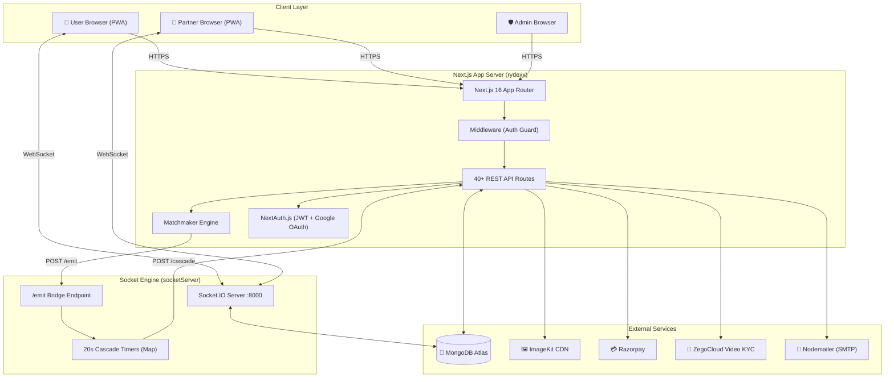
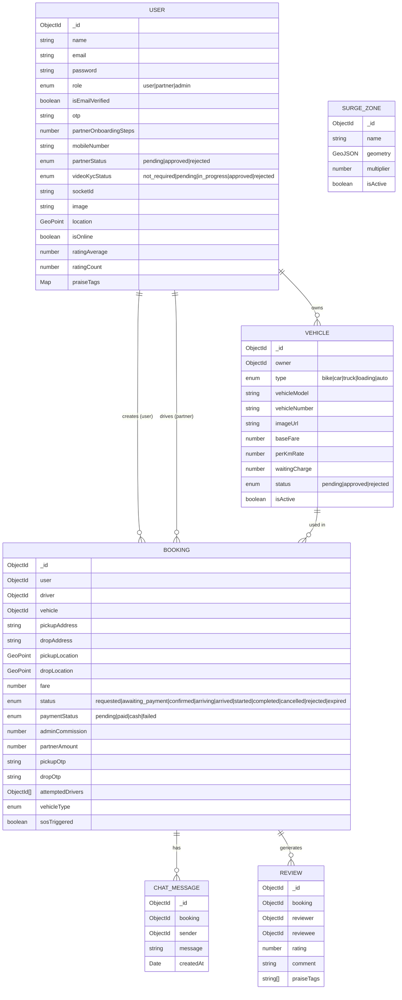
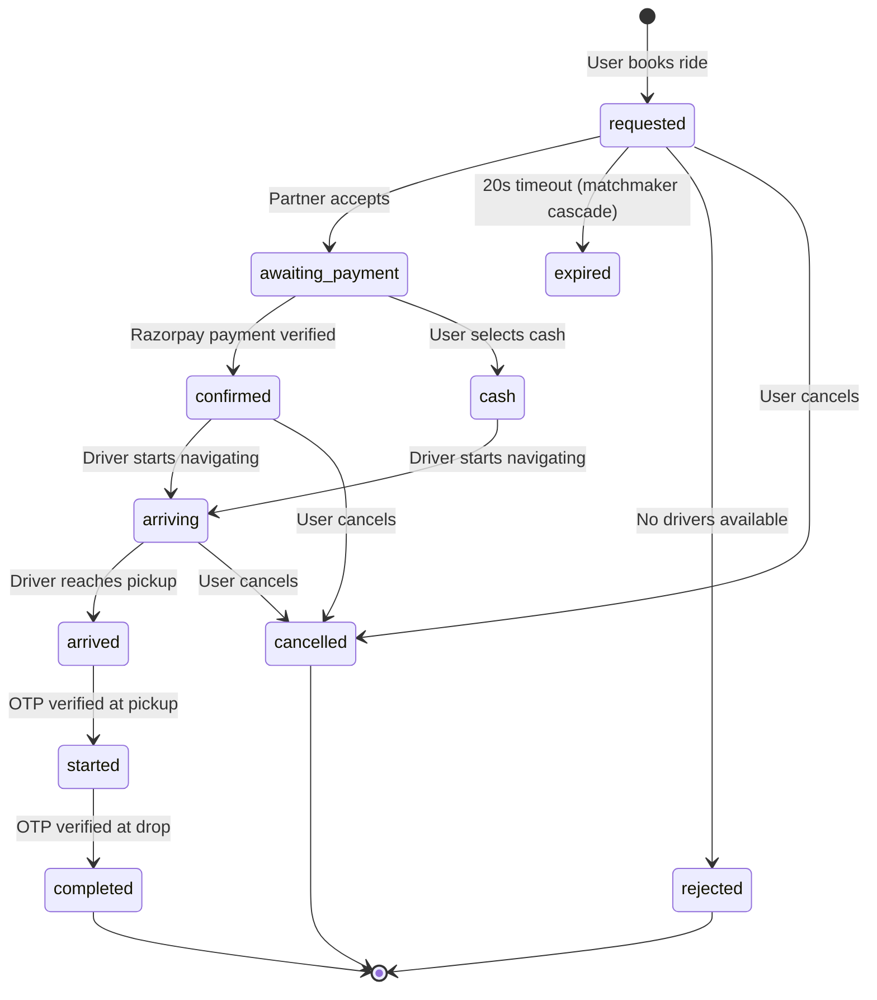
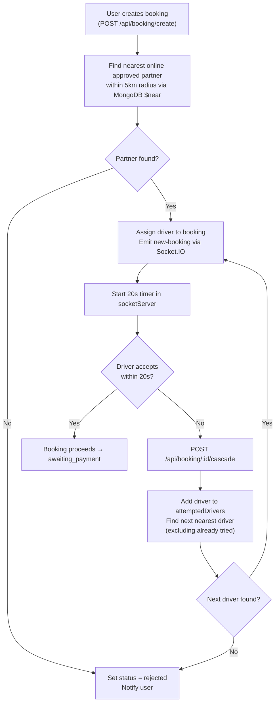
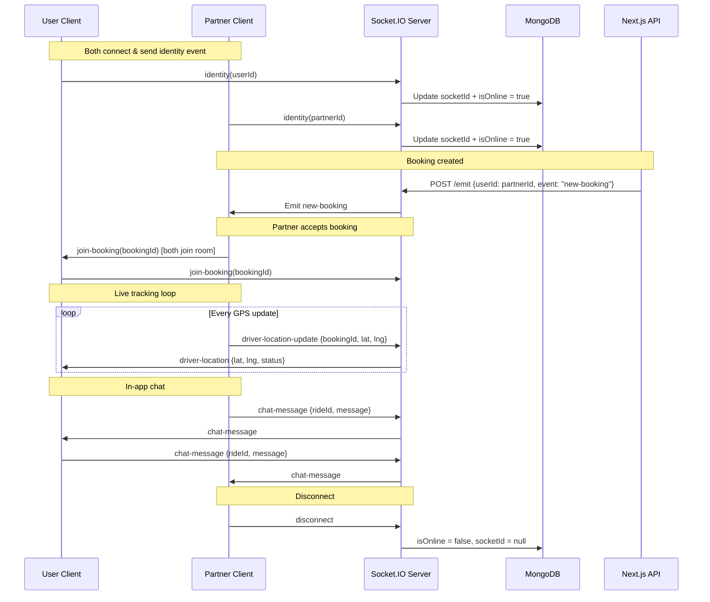

<div align="center">


# Rydex

### A full-stack, real-time multi-vehicle booking & logistics platform

[](https://nextjs.org/)
[](https://www.typescriptlang.org/)
[](https://tailwindcss.com/)
[](https://socket.io/)
[](https://www.mongodb.com/)
[](https://razorpay.com/)
[](https://opensource.org/licenses/MIT)
[](https://rydexx.netlify.app)

**Book any vehicle. Track every move. Pay in seconds.**  
Bikes · Cars · SUVs · Vans · Trucks · Auto-rickshaws

[Live Demo](https://rydexx.netlify.app) · [Frontend Docs](./rydexx/README.md) · [Socket Server Docs](./socketServer/README.md)

</div>

---

## Table of Contents

- [Overview](#overview)
- [Monorepo Structure](#monorepo-structure)
- [System Architecture](#system-architecture)
- [Tech Stack](#tech-stack)
- [Feature Map](#feature-map)
- [Data Models](#data-models)
- [Booking Lifecycle](#booking-lifecycle)
- [Matchmaker Algorithm](#matchmaker-algorithm)
- [Real-time Event Pipeline](#real-time-event-pipeline)
- [API Reference](#api-reference)
- [Environment Variables](#environment-variables)
- [Testing](#testing)
- [Getting Started](#getting-started)
- [Deployment](#deployment)
- [Author](#author)

---

## Overview

**Rydex** is a production-grade, real-time vehicle booking ecosystem. Think Uber, but for every vehicle type imaginable — from a ₹30 bike ride to a 10-tonne truck for industrial logistics.

The platform is split into two deployable units:

| Unit | Tech | Purpose |
|---|---|---|
| `rydexx/` | Next.js 16 + TypeScript | Frontend PWA + all REST API routes |
| `socketServer/` | Node.js + Express + Socket.IO | Dedicated real-time WebSocket engine |

---

## Monorepo Structure

```
rydex/
├── rydexx/                     # Next.js 16 App (Frontend + API)
│   ├── src/
│   │   ├── app/                # App Router pages & API routes
│   │   │   ├── (pages)/        # All UI pages (ride, bookings, fleet, etc.)
│   │   │   └── api/            # 40+ REST API route handlers
│   │   ├── components/         # 25+ React components
│   │   ├── lib/                # Core utilities (auth, db, matchmaker, socket, email)
│   │   ├── models/             # Mongoose schemas (User, Booking, Vehicle, etc.)
│   │   ├── redux/              # Global state (Redux Toolkit)
│   │   ├── hooks/              # Custom React hooks
│   │   └── middleware.ts       # Route protection middleware
│   ├── public/                 # Static assets (logo, hero image, PWA icons)
│   ├── next.config.ts          # Next.js + Turbopack + PWA config
│   └── package.json
│
├── socketServer/               # Real-time Engine (Socket.IO)
│   ├── index.js                # WebSocket server, CORS, matchmaker timer
│   ├── models/
│   │   └── user.models.js      # Lightweight user model (socketId, location)
│   └── package.json
│
└── readme.md                   # ← You are here
```

---

## System Architecture



---

## Tech Stack

### Frontend (`rydexx`)

| Layer | Technology | Version | Role |
|---|---|---|---|
| Framework | **Next.js** | 16.2.1 | App Router, RSC, SSR, API Routes |
| Language | **TypeScript** | 5.x | Full type safety |
| Styling | **Tailwind CSS** | 4.x | Utility-first CSS |
| Animation | **Motion (Framer Motion)** | 12.x | Page & micro-animations |
| Maps | **Mapbox GL JS** + **React Map GL** | 3.x / 8.x | Live tracking, route display |
| Draw | **@mapbox/mapbox-gl-draw** | 1.5 | Surge zone polygon editor |
| State | **Redux Toolkit** | 2.x | Global user & booking state |
| Auth | **NextAuth.js v5** | beta.30 | Google OAuth + Credentials |
| HTTP | **Axios** | 1.x | Client-side API calls |
| Data Fetch | **SWR** | 2.x | Client-side data fetching with cache |
| Charts | **Recharts** | 3.x | Partner earnings & analytics |
| Icons | **Lucide React** | 1.x | Icon system |
| Payments | **Razorpay JS** | — | Checkout flow |
| Video KYC | **ZegoCloud UIKit** | 2.x | In-browser video calls |
| Images | **ImageKit** | 6.x | CDN upload + optimization |
| PWA | **@ducanh2912/next-pwa** | 10.x | Service worker, installable |
| Email | **Nodemailer** | 7.x | Transactional email |
| DB Client | **Mongoose** | 9.x | MongoDB ODM |
| Realtime | **Socket.IO Client** | 4.x | WebSocket connection |
| Passwords | **bcryptjs** | 3.x | Password hashing |

### Backend Socket Server (`socketServer`)

| Technology | Version | Role |
|---|---|---|
| **Node.js** | 24.x | Runtime |
| **Express** | 4.x | HTTP server + `/emit` endpoint |
| **Socket.IO** | 4.x | WebSocket engine |
| **Mongoose** | 9.x | MongoDB ODM |
| **Axios** | 1.x | Internal HTTP calls (cascade) |
| **dotenv** | — | Environment config |
| **nodemon** | 3.x | Dev auto-restart |

---

## Feature Map

### 👤 User Features
```
├── Auth
│   ├── Google OAuth (one-click)
│   ├── Email + Password (bcrypt)
│   └── OTP Email Verification
├── Booking
│   ├── Vehicle type selector (bike/car/SUV/van/truck/auto)
│   ├── Mapbox address autocomplete
│   ├── Real-time fare calculation (baseFare + perKm + waiting)
│   ├── Razorpay checkout (UPI, cards, wallets)
│   └── Cash payment option
├── Ride Experience
│   ├── Live driver tracking (Mapbox + Socket.IO)
│   ├── OTP-verified pickup & drop
│   ├── In-app chat with driver
│   ├── SOS emergency trigger
│   └── Trip share link (public, no-auth)
├── Post-Ride
│   ├── Rate & review driver
│   └── Praise tag system
└── History
    └── Full booking history with status filters
```

### 🚗 Partner (Driver) Features
```
├── Onboarding
│   ├── 8-step onboarding flow
│   ├── Vehicle registration (type, model, plate, image)
│   ├── Document upload (ImageKit CDN)
│   ├── Bank details
│   ├── Pricing setup (baseFare, perKm, waitingCharge)
│   └── Video KYC (ZegoCloud)
├── Operations
│   ├── Live booking requests (Socket.IO push)
│   ├── Accept / Reject incoming bookings
│   ├── OTP-based ride start & end
│   ├── GPS location broadcast
│   └── In-app chat with rider
└── Analytics
    ├── Earnings dashboard (Recharts)
    ├── Weekly/monthly trends
    ├── Commission breakdown
    └── Booking history & status
```

### 🛡️ Admin Features
```
├── Partner Management
│   ├── Approve / Reject partner applications
│   ├── Approve / Reject vehicle registrations
│   └── Video KYC management
├── Live Map
│   ├── All active drivers on map
│   ├── Live booking heatmap
│   └── Surge zone editor (polygon draw)
├── Financials
│   └── Platform earnings & commission tracking
└── Reviews
    └── Pending partner/vehicle review queue
```

---

## Data Models



---

## Booking Lifecycle



---

## Matchmaker Algorithm

When a booking is created, the system assigns the nearest available driver. If that driver doesn't accept within **20 seconds**, the **cascade** triggers automatically.



---

## Real-time Event Pipeline



---

## API Reference

### Auth
| Method | Endpoint | Description |
|---|---|---|
| `POST` | `/api/auth/register` | Register with email + password |
| `POST` | `/api/auth/verify-email` | Verify OTP from email |
| `GET/POST` | `/api/auth/[...nextauth]` | NextAuth handlers (Google OAuth) |

### Booking
| Method | Endpoint | Description |
|---|---|---|
| `POST` | `/api/booking/create` | Create new booking + trigger matchmaker |
| `GET` | `/api/booking/my-active` | Get user's active booking |
| `GET` | `/api/booking/[id]/status` | Poll booking status |
| `POST` | `/api/booking/[id]/accept` | Partner accepts booking |
| `POST` | `/api/booking/[id]/reject` | Partner rejects booking |
| `POST` | `/api/booking/[id]/arriving` | Partner marks as arriving |
| `POST` | `/api/booking/[id]/arrived` | Partner marks as arrived |
| `POST` | `/api/booking/[id]/start` | Start ride (pickup OTP verified) |
| `POST` | `/api/booking/[id]/complete` | Complete ride (drop OTP verified) |
| `POST` | `/api/booking/[id]/cancel` | Cancel booking |
| `POST` | `/api/booking/[id]/cascade` | Internal: trigger matchmaker cascade |
| `POST` | `/api/booking/[id]/confirm-payment` | Verify Razorpay payment |
| `POST` | `/api/booking/[id]/sos` | Trigger SOS alert |
| `GET` | `/api/booking/[id]/share` | Public trip share link data |

### Partner
| Method | Endpoint | Description |
|---|---|---|
| `POST` | `/api/partner/onboarding/vehicle` | Register vehicle |
| `POST` | `/api/partner/onboarding/documents` | Upload KYC documents |
| `POST` | `/api/partner/onboarding/bank` | Save bank details |
| `POST` | `/api/partner/onboarding/pricing` | Set fare pricing |
| `GET` | `/api/partner/bookings/pending` | Pending booking requests |
| `GET` | `/api/partner/bookings/active` | Currently active ride |
| `GET` | `/api/partner/bookings/counts` | Badge counts (pending/active) |
| `POST` | `/api/partner/bookings/send-pickup-otp` | Send OTP to user |
| `POST` | `/api/partner/bookings/verify-pickup-otp` | Verify pickup OTP |
| `POST` | `/api/partner/bookings/send-drop-otp` | Send drop OTP |
| `POST` | `/api/partner/bookings/verify-drop-otp` | Verify drop OTP |
| `GET` | `/api/partner/earning` | Earnings data |
| `GET` | `/api/partner/analytics` | Full analytics dashboard data |
| `GET/POST` | `/api/partner/video-kyc` | Video KYC session |

### Admin
| Method | Endpoint | Description |
|---|---|---|
| `GET` | `/api/admin/dashboard` | Dashboard KPIs |
| `GET` | `/api/admin/earnings` | Platform commission data |
| `GET` | `/api/admin/map/live-data` | All active drivers for map |
| `GET` | `/api/admin/map/heatmap` | Booking heatmap data |
| `GET/POST` | `/api/admin/surge-zones` | Manage surge pricing zones |
| `GET` | `/api/admin/reviews/partner` | Pending partner approvals |
| `POST` | `/api/admin/reviews/partner/[id]/approve` | Approve partner |
| `POST` | `/api/admin/reviews/partner/[id]/reject` | Reject partner |
| `GET` | `/api/admin/reviews/vehicle` | Pending vehicle reviews |
| `GET` | `/api/admin/video-kyc/pending` | Pending KYC queue |
| `POST` | `/api/admin/video-kyc/start/[id]` | Start admin KYC session |
| `POST` | `/api/admin/video-kyc/complete/[id]` | Mark KYC complete |

### Payments
| Method | Endpoint | Description |
|---|---|---|
| `POST` | `/api/payment/create` | Create Razorpay order |
| `POST` | `/api/payment/verify` | Verify payment signature |

### Other
| Method | Endpoint | Description |
|---|---|---|
| `GET` | `/api/me` | Get current user profile |
| `GET` | `/api/user/me` | Extended user data |
| `GET` | `/api/user/bookings` | User booking history |
| `GET` | `/api/vehicles` | List available vehicles |
| `GET` | `/api/vehicles/nearby` | Find nearby vehicles by type |
| `POST` | `/api/chat/send` | Send chat message |
| `GET` | `/api/chat/get-all` | Get all messages for a booking |
| `POST` | `/api/reviews` | Submit a review |
| `POST` | `/api/metrics/search-log` | Log a vehicle search |

### Socket Server Internal
| Method | Endpoint | Description |
|---|---|---|
| `GET` | `/health` | Health check |
| `POST` | `/emit` | Targeted socket emit by userId |

---

## Environment Variables

### `rydexx/.env.local`
```env
# Database
MONGODB_URL=mongodb+srv://<user>:<pass>@cluster.mongodb.net/rydex

# Auth
AUTH_SECRET=<random-secret-32-chars>
AUTH_GOOGLE_ID=<google-oauth-client-id>
AUTH_GOOGLE_SECRET=<google-oauth-client-secret>

# Socket Server
SOCKET_SERVER_URL=http://localhost:8000

# ImageKit
IMAGEKIT_PUBLIC_KEY=<public-key>
IMAGEKIT_PRIVATE_KEY=<private-key>
IMAGEKIT_URL_ENDPOINT=https://ik.imagekit.io/<your-id>

# Razorpay
RAZORPAY_KEY_ID=<key-id>
RAZORPAY_KEY_SECRET=<key-secret>

# ZegoCloud
ZEGO_APP_ID=<app-id>
ZEGO_SERVER_SECRET=<server-secret>

# Email
EMAIL_USER=<gmail-address>
EMAIL_PASS=<app-password>

# App
NEXT_PUBLIC_BASE_URL=http://localhost:3000
NEXT_PUBLIC_MAPBOX_TOKEN=<mapbox-token>
```

### `socketServer/.env`
```env
PORT=8000
MONGODB_URL=mongodb+srv://<user>:<pass>@cluster.mongodb.net/rydex
NEXT_BASE_URL=http://localhost:3000
CLIENT_URL=http://localhost:3000
```

---

## Testing

Rydex includes a comprehensive testing suite for both the Next.js app (`rydexx`) and the WebSocket engine (`socketServer`) to verify APIs, authentication, file uploads, and real-time events.

### Testing Architecture
* **In-Memory MongoDB:** Both directories use `mongodb-memory-server` to spin up isolated MongoDB instances in RAM for database integration tests.
* **In-Memory Redis:** The socket server mocks Redis clustering capabilities using `ioredis-mock`.
* **API Route Mocking:** NextAuth sessions and ImageKit file uploads are dynamically mocked for API validation.

### Running the Tests

**1. Next.js App / REST APIs (`rydexx`):**
```bash
cd rydexx
npm run test
```

**2. WebSocket Server (`socketServer`):**
```bash
cd socketServer
npm run test
```

For detailed testing guides and structures, refer to [Frontend Testing Docs](./rydexx/README.md#testing) and [Socket Server Testing Docs](./socketServer/README.md#testing).

---

## Getting Started

### Prerequisites

- Node.js **v20+**
- MongoDB Atlas cluster (or local MongoDB)
- Mapbox account (free tier works)
- Google Cloud project with OAuth credentials
- Razorpay account (test mode)

### 1. Clone the repo

```bash
git clone https://github.com/Zuhaib-dev/rydex.git
cd rydex
```

### 2. Start the Socket Server

```bash
cd socketServer
npm install
# Create .env from the template above
npm run dev
# → server started at 8000
```

### 3. Start the Next.js App

```bash
cd rydexx
npm install
# Create .env.local from the template above
npm run dev
# → http://localhost:3000
```

### 4. Access the app

| URL | Description |
|---|---|
| `http://localhost:3000` | Public landing page |
| `http://localhost:3000/user/book` | Book a ride (auth required) |
| `http://localhost:3000/partner/...` | Partner dashboard |
| `http://localhost:8000/health` | Socket server health check |

---

## Deployment

| Service | Unit | Notes |
|---|---|---|
| **Netlify** | `rydexx` | SSR via Netlify Next.js adapter |
| **Railway / Render** | `socketServer` | Always-on Node.js process |
| **MongoDB Atlas** | Database | Shared cluster, M0 free tier works |
| **ImageKit** | Media | Free 20GB/month |

> **Important:** The socket server must be deployed to a service that supports persistent WebSocket connections. Serverless platforms (Vercel functions, Netlify functions) **will not work** for `socketServer`.

---

## Author

<div align="center">

**Zuhaib Rashid**  
Full-stack engineer · UI/UX obsessive · Real-time systems nerd

[](https://zuhaibrashid.com)
[](https://github.com/Zuhaib-dev)
[](https://www.linkedin.com/in/zuhaib-rashid-661345318/)
[](https://x.com/xuhaib_x9)

*Built with obsessive attention to detail, real-world production patterns, and way too much coffee.*

</div>