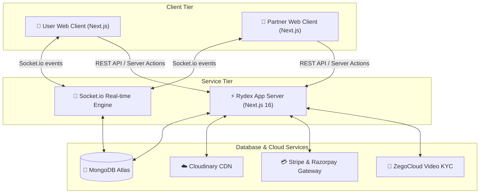

<div align="center">


# 🚀 Rydex: The Ultimate Multi-Vehicle Booking & Logistics Ecosystem

[](https://nextjs.org/)
[](https://tailwindcss.com/)
[](https://socket.io/)
[](https://www.mongodb.com/)
[](https://opensource.org/licenses/MIT)

**Because walking is overrated, teleportation isn't ready, and your logistics need to move at the speed of light! ⚡**

[Explore Features](#-key-features) • [System Architecture](#-system-architecture) • [Getting Started](#-getting-started) • [Meet the Maker](#-behind-the-code-zuhaib-rashid)

---


</div>

## 📖 Overview

**Rydex** is a ultra-premium, full-stack vehicle booking and real-time logistics ecosystem designed for modern demands. Whether you need a quick bike ride to escape traffic, a comfortable sedan for a business meeting, or a heavy-duty multi-axle truck to ship tons of cargo across the country—Rydex connects users with reliable partners dynamically.

Built with cutting-edge tech like **Next.js 16**, **Tailwind CSS 4**, **Socket.io**, and **MongoDB**, Rydex offers zero-latency real-time ride tracking, bulletproof payment processing, and high-fidelity video KYC onboarding.

---

## 🛠 Tech Stack Matrix

| Component | Technology | What it does in Rydex |
| :--- | :--- | :--- |
| **Frontend UI/UX** | `Next.js 16`, `Tailwind CSS 4`, `Framer Motion` | Gorgeous fluid visuals, layout animations, and optimized server component performance. |
| **State & Navigation** | `Redux Toolkit`, `Lucide React` | Seamless reactive states and modern iconographies. |
| **Maps & Tracking** | `Leaflet`, `React Leaflet` | Zero-cost open-source mapping with high performance and custom marker clusters. |
| **Real-time Engine** | `Socket.io` (Dedicated Server Node) | Bidirectional, ultra-low latency websocket tunnels for ride requests, chats, and coordinates. |
| **Core Database** | `MongoDB` & `Mongoose` | Scalable document mapping for users, partners, rides, and dynamic pricing metrics. |
| **Authentication** | `NextAuth.js` | Bulletproof JWT session management and OAuth providers. |
| **Gateways** | `Stripe` & `Razorpay` | Double-shielded, dual-gateway payment checkout supporting global and domestic transactions. |
| **Comms & Media** | `Zegocloud` & `Nodemailer` | In-app video/voice KYC and instant email notifications. |
| **Storage** | `Cloudinary` | Fast CDN-hosted media delivery for KYC documents and driver profile pics. |

---

## ✨ Key Features

### 👤 For Users
* **Multi-Vehicle Selector:** Book Bikes 🏍, Cars 🚗, Buses 🚌, or Heavy Trucks 🚛 with custom fares.
* **Live Ride Tracking:** Real-time marker movements on Leaflet maps powered by `Socket.io`.
* **Flexible Payments:** Choose Stripe for international cards or Razorpay for UPI and instant wallets.
* **Instant Chat:** Chat directly with your driver without closing the ride panel.

### 🚛 For Driving Partners
* **Interactive Earnings Portal:** Beautiful `Recharts` displaying weekly metrics, commission deductions, and trip trends.
* **Secured OTP Rides:** Start rides safely. Drivers must input a user-provided OTP before starting the engine.
* **Video KYC Verification:** Fully automated driver onboarding via high-quality `Zegocloud` video verification.

### 🛡 For Platform Admins
* **Central Control Tower:** Monitor all active drivers, user complaints, and active ride pathways globally.
* **Geo-Fencing & Monitoring:** Visual heatmaps showing demand spikes and driver density.

---

## 📐 System Architecture

Here is the high-level architecture diagram showing how the frontend application communicates with the dedicated real-time socket server, databases, and payment processors:



---

## 🚀 Getting Started

### Prerequisites
- **Node.js** (v20+ recommended)
- **MongoDB** (Local instance or MongoDB Atlas URI)
- **Git** (Because we love version control)

### 1. Clone & Enter
```bash
git clone https://github.com/Zuhaib-dev/rydex.git
cd rydex
```

### 2. Launch the Web Core (`rydexx`)
```bash
cd rydexx
npm install
npm run dev
```
*Your frontend and API routes are now live on [http://localhost:3000](http://localhost:3000)* 🎉

### 3. Launch the Real-Time engine (`socketServer`)
```bash
cd ../socketServer
npm install
npm run dev
```
*The Websocket engine is now listening for incoming ride telemetry on port `5000`!* ⚡

---

## 🦸 Behind the Code: Zuhaib Rashid

This repository is built, polished, and maintained by **Zuhaib Rashid**, a full-stack engineering wizard who loves crafting pixel-perfect, highly scalable architectures.

> "I don't just write code. I engineer digital experiences that look stunning and perform under pressure."

<div align="center">

### 🌐 Connect with the Wizard
[](https://zuhaibrashid.com)
[](https://github.com/Zuhaib-dev)
[](https://www.linkedin.com/in/zuhaib-rashid-661345318/)
[](https://x.com/xuhaib_x9)

</div>

---

<div align="center">
  <p>Built with ❤️, pure caffeine ☕, and absolute dedication by Zuhaib.</p>
</div>