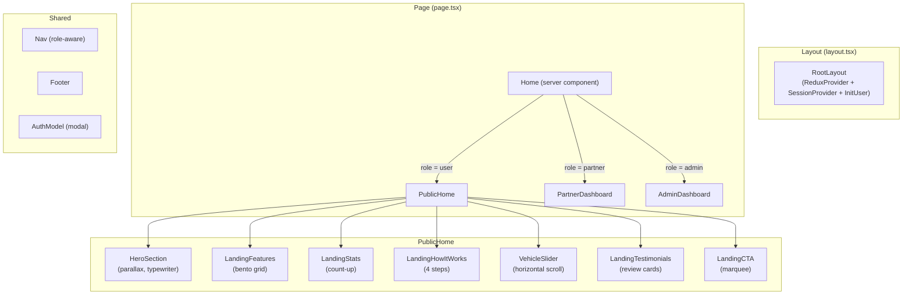
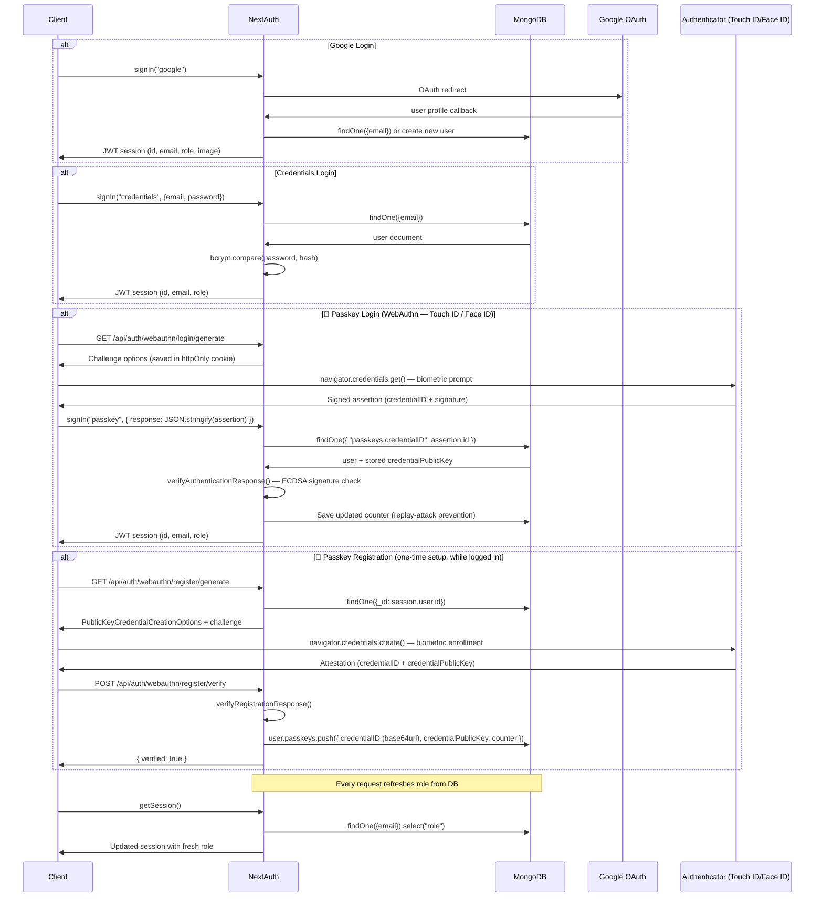

<div align="center">

# `rydexx` — Rydex Frontend & API

### Next.js 16 · TypeScript · Tailwind CSS 4 · Mapbox · Socket.IO

[](https://nextjs.org/)
[](https://www.typescriptlang.org/)
[](https://tailwindcss.com/)
[](https://web.dev/progressive-web-apps/)

</div>

--- 

## What This Is

This is the main application — the **Next.js 16 App Router** project that serves:
- The **public landing page** (cinematic hero, feature bento, testimonials, CTA)
- The **user booking flow** (vehicle select → map → fare → checkout)
- The **partner dashboard** (live requests, earnings charts, KYC)
- The **admin control center** (live map, approvals, surge zones)
- **40+ REST API routes** (all under `/src/app/api/`)

---

## Project Structure

```
rydexx/
├── src/
│   ├── app/                            # Next.js App Router
│   │   ├── page.tsx                    # Root page (role-aware: user/partner/admin)
│   │   ├── layout.tsx                  # Root layout + SEO metadata + PWA tags
│   │   ├── globals.css                 # Tailwind + global scroll/font styles
│   │   ├── robots.ts                   # SEO robots config
│   │   ├── sitemap.ts                  # Auto-generated sitemap
│   │   │
│   │   ├── about/                      # About page
│   │   ├── bookings/                   # User booking history
│   │   ├── checkout/                   # Razorpay checkout page
│   │   ├── contact/                    # Contact page
│   │   ├── faq/                        # FAQ page
│   │   ├── fleet/                      # Browse vehicle fleet
│   │   ├── partner/                    # All partner routes
│   │   │   ├── active-ride/            # Current active ride view
│   │   │   ├── bookings/               # Partner booking history
│   │   │   ├── onboarding/             # 8-step onboarding wizard
│   │   │   ├── pending-requests/       # Incoming booking requests
│   │   │   └── vehicle/                # My vehicle management
│   │   ├── privacy/                    # Privacy policy
│   │   ├── ride/                       # Live ride tracking view
│   │   ├── share/                      # Public trip share (no auth)
│   │   ├── terms/                      # Terms of service
│   │   ├── user/
│   │   │   └── book/                   # Vehicle booking wizard
│   │   ├── video-kyc/                  # Video KYC session page
│   │   │
│   │   └── api/                        # ← All API routes (40+)
│   │       ├── auth/                   # Register, verify-email, NextAuth, WebAuthn passkey
│   │       │   ├── webauthn/
│   │       │   │   ├── register/
│   │       │   │   │   ├── generate/   # GET: Create registration options + challenge
│   │       │   │   │   └── verify/     # POST: Verify attestation + store credential
│   │       │   │   └── login/
│   │       │   │       └── generate/   # GET: Create authentication challenge
│   │       ├── booking/                # Full booking CRUD & state machine
│   │       ├── admin/                  # Admin endpoints
│   │       ├── partner/                # Partner-specific endpoints
│   │       ├── payment/                # Razorpay create + verify
│   │       ├── chat/                   # In-ride messaging
│   │       ├── reviews/                # Post-ride reviews
│   │       ├── vehicles/               # Vehicle listings + nearby search
│   │       ├── metrics/                # Search log analytics
│   │       ├── me/                     # Current user profile
│   │       └── socket/                 # Socket auth connect
│   │
│   ├── components/                     # 25+ React components
│   │   ├── ── Landing Page ──
│   │   ├── HeroSection.tsx             # Cinematic hero (parallax, typewriter, CTA)
│   │   ├── LandingFeatures.tsx         # Dark bento-grid features
│   │   ├── LandingStats.tsx            # Animated count-up stats
│   │   ├── LandingHowItWorks.tsx       # 4-step dark how-it-works
│   │   ├── LandingTestimonials.tsx     # Review cards grid
│   │   ├── LandingCTA.tsx              # Final CTA with marquee
│   │   ├── VehicleSlider.tsx           # Scrollable vehicle category cards
│   │   ├── PublicHome.tsx              # Landing page composer
│   │   │
│   │   ├── ── Navigation ──
│   │   ├── Nav.tsx                     # Smart navbar (role-aware, profile dropdown)
│   │   ├── Footer.tsx                  # Footer with socials
│   │   │
│   │   ├── ── Auth ──
│   │   ├── AuthModel.tsx               # Sign in / Sign up modal
│   │   │
│   │   ├── ── Maps ──
│   │   ├── LiveTrackingMap.tsx         # Real-time driver tracking (Mapbox)
│   │   ├── RouteMap.tsx                # Static route display
│   │   ├── ShareTripMap.tsx            # Public trip share map
│   │   ├── AdminLiveMap.tsx            # Admin all-drivers map
│   │   │
│   │   ├── ── Partner ──
│   │   ├── PartnerDashboard.tsx        # Partner home (requests + stats)
│   │   ├── PartnerAnalyticsHub.tsx     # Full analytics (Recharts)
│   │   ├── PartnerEarningChart.tsx     # Earnings line chart
│   │   ├── StatusCard.tsx              # Booking status card (ride view)
│   │   ├── RideChat.tsx                # In-ride chat interface
│   │   │
│   │   ├── ── Admin ──
│   │   ├── AdminDashboard.tsx          # Admin KPI overview
│   │   ├── AdminEarning.tsx            # Commission charts
│   │   ├── KPI.tsx                     # KPI metric card
│   │   │
│   │   ├── ── Booking ──
│   │   ├── VehicleBookingCard.tsx      # Vehicle selection card
│   │   ├── CheckoutClient.tsx          # Razorpay checkout UI
│   │   ├── AnimateCard.tsx             # Animated card wrapper
│   │   ├── ContentList.tsx             # Feature list component
│   │   │
│   │   ├── ── Utility ──
│   │   ├── GeoUpdater.tsx              # Partner GPS broadcaster
│   │   ├── VideoKYCBanner.tsx          # KYC status banner
│   │   └── InstallPWA.tsx              # Add-to-homescreen prompt
│   │
│   ├── lib/                            # Core server-side utilities
│   │   ├── auth.ts                     # NextAuth config (Google + Credentials + Passkey)
│   │   ├── webauthn.ts                 # WebAuthn helpers (rpID, expected origin)
│   │   ├── db.ts                       # MongoDB connection singleton
│   │   ├── matchmaker.ts               # Cascade booking algorithm
│   │   ├── bookingEvents.ts            # Socket emit helpers
│   │   ├── socketServer.ts             # HTTP bridge to socket server
│   │   ├── socket.ts                   # Client-side Socket.IO singleton
│   │   ├── imagekit.ts                 # Server-side ImageKit auth
│   │   ├── imagekit-client.ts          # Client-side ImageKit upload
│   │   ├── razorpay.ts                 # Razorpay instance
│   │   ├── sendMail.ts                 # Nodemailer send helper
│   │   └── emailTemplate.ts            # HTML email templates
│   │
│   ├── models/                         # Mongoose schemas
│   │   ├── user.model.ts               # User (all roles)
│   │   ├── booking.model.ts            # Booking (full state machine)
│   │   ├── vehicle.model.ts            # Vehicle registration
│   │   ├── review.model.ts             # Post-ride reviews
│   │   ├── chatMessage.model.ts        # In-ride chat messages
│   │   ├── partnerBank.model.ts        # Partner bank details
│   │   ├── partnerDocs.model.ts        # KYC document storage
│   │   ├── searchLog.model.ts          # Search analytics
│   │   └── surgeZone.model.ts          # Dynamic pricing zones
│   │
│   ├── redux/                          # Global state management
│   │   ├── store.ts                    # Redux store
│   │   ├── userSlice.ts                # User data slice
│   │   └── ReduxProvider.tsx           # Client-side store provider
│   │
│   ├── hooks/                          # Custom React hooks
│   ├── middleware.ts                   # Route protection (auth guard)
│   ├── InitUser.tsx                    # Bootstrap user data on mount
│   ├── Provider.tsx                    # NextAuth SessionProvider
│   ├── global.d.ts                     # Global type declarations
│   └── types.d.ts                      # Shared type definitions
│
├── public/
│   ├── heroImage.jpg                   # Landing hero background
│   ├── logo.png                        # Rydex logo
│   ├── manifest.json                   # PWA manifest
│   ├── icon-72x72.png                  # PWA icons (multiple sizes)
│   ├── icon-96x96.png
│   ├── icon-144x144.png
│   ├── icon-192x192.png
│   ├── icon-512x512.png
│   ├── apple-touch-icon.png
│   └── ogimage.webp                    # Open Graph social image
│
├── next.config.ts                      # Next.js + Turbopack + PWA config
├── tailwind.config.ts                  # Tailwind v4 config
├── tsconfig.json                       # TypeScript config
└── package.json
```

---

## Page Routes

| Route | Auth | Role | Description |
|---|---|---|---|
| `/` | No | All | Landing page (role-aware home) |
| `/about` | No | All | About Rydex |
| `/contact` | No | All | Contact page |
| `/faq` | No | All | Frequently asked questions |
| `/fleet` | No | All | Browse vehicle types |
| `/privacy` | No | All | Privacy policy |
| `/terms` | No | All | Terms of service |
| `/bookings` | ✅ | user | Booking history |
| `/user/book` | ✅ | user | Book a vehicle |
| `/checkout` | ✅ | user | Razorpay checkout |
| `/ride` | ✅ | user | Live ride tracking |
| `/share/[id]` | No | All | Public trip share |
| `/partner/pending-requests` | ✅ | partner | Incoming booking requests |
| `/partner/active-ride` | ✅ | partner | Current ride management |
| `/partner/bookings` | ✅ | partner | Partner booking history |
| `/partner/vehicle` | ✅ | partner | My vehicle |
| `/partner/onboarding/...` | ✅ | partner | 8-step onboarding |
| `/video-kyc` | ✅ | partner/admin | Video KYC session |

---

## Component Architecture



---

## Authentication Flow



---

## PWA Configuration

Rydex is fully installable as a Progressive Web App:

| Feature | Implementation |
|---|---|
| Service Worker | `@ducanh2912/next-pwa` (Workbox) |
| App Manifest | `/public/manifest.json` |
| Icons | 72 / 96 / 144 / 192 / 512px PNG + Apple touch |
| Theme Color | `#0a0a0a` (dark) |
| Status Bar | `black-translucent` (iOS) |
| Cache Strategy | Aggressive front-end nav caching |
| Offline | Service worker caches critical routes |

---

## Key Libraries Deep Dive

### Mapbox GL
Used for all map views. Three distinct map components:
- `LiveTrackingMap` — animates driver marker in real-time as Socket.IO pushes coords
- `RouteMap` — displays static pickup→drop route with polyline
- `AdminLiveMap` — clusters all active online partners on a single map

### Motion (Framer Motion v12)
Used throughout for:
- Parallax scroll on hero (`useScroll` + `useTransform`)
- `whileInView` entrance animations on every section
- Spring physics on modal sheets and dropdowns
- Infinite marquee in CTA section

### Redux Toolkit
Single slice: `userSlice` — stores the full user document after login. This avoids re-fetching from the DB on every page and keeps the nav/profile panel snappy.

### Recharts
Used in `PartnerEarningChart` and `PartnerAnalyticsHub` for:
- Area chart (weekly earnings)
- Bar chart (trip count by day)
- Pie chart (vehicle type distribution)

### Firebase Cloud Messaging (FCM)
Push notification system for offline users:
- Client-side: `useFCM()` hook requests browser notification permissions and manages FCM tokens
- Service Worker: `/public/firebase-messaging-sw.js` handles background notifications
- Multi-device support: Tokens stored per-device in `User.fcmTokens` array
- Automatic cleanup: Invalid tokens are removed server-side
- Events: Triggered on `new-booking`, `booking-updated`, and system notifications

---

## Passkey Authentication (WebAuthn)

Rydex implements **passwordless biometric login** using the [WebAuthn API](https://www.w3.org/TR/webauthn-2/) via **@simplewebauthn/server** (v9) and **@simplewebauthn/browser** (v9).

### How It Works

Once logged in, a user clicks **"Register Passkey (Biometrics)"** from their profile menu. The browser prompts them to use their device authenticator — **Touch ID, Face ID, Windows Hello, or a fingerprint sensor**. From that point on, they can log in without a password — just a tap.

### User Flow

```
1. Login with Google / Email+Password (one-time)
2. Open profile menu → click "Register Passkey (Biometrics)"
3. Browser shows biometric prompt (Touch ID / Face ID)
4. Passkey is stored in MongoDB against your account
5. Next time: click "Continue with Passkey" on the login screen
6. Tap fingerprint → logged in instantly ✅
```

### Updating a Passkey

If you register a new device or want to update your passkey, click **"Register Passkey"** again. An inline confirmation prompt appears:
> **"You already have a passkey registered. Do you want to replace it with a new one?"**  
> **Yes, Replace** / **Cancel**

Confirming will remove the old credential and enroll the new one.

### Security Details

| Property | Detail |
|---|---|
| Standard | WebAuthn Level 2 (W3C) |
| Library | `@simplewebauthn/server` v9 + `@simplewebauthn/browser` v9 |
| Credential type | Platform authenticator only (Touch ID, Face ID, Windows Hello) |
| Storage | `credentialID` (base64url string) + `credentialPublicKey` (Buffer) in MongoDB |
| Challenge | Random, stored in **httpOnly + Secure cookie** (5-min TTL) |
| Replay protection | Counter incremented on every authentication; server rejects stale counters |
| Origin binding | Credentials locked to the domain (RPID = hostname) — phishing-proof |
| User lookup | Credential ID matched in DB via `{ "passkeys.credentialID": response.id }` |

### API Endpoints

| Method | Endpoint | Auth | Description |
|---|---|---|---|
| `GET` | `/api/auth/webauthn/register/generate` | ✅ Required | Generate registration options + challenge |
| `GET` | `/api/auth/webauthn/register/generate?check=true` | ✅ Required | Check if user has existing passkeys |
| `GET` | `/api/auth/webauthn/register/generate?replace=true` | ✅ Required | Generate options without excluding existing credential |
| `POST` | `/api/auth/webauthn/register/verify` | ✅ Required | Verify attestation + save credential to DB |
| `GET` | `/api/auth/webauthn/login/generate` | ❌ Public | Generate authentication challenge (stored in cookie) |

### Files Involved

| File | Role |
|---|---|
| [`src/lib/webauthn.ts`](./src/lib/webauthn.ts) | `rpName`, `getRpID()`, `getExpectedOrigin()` helpers |
| [`src/lib/auth.ts`](./src/lib/auth.ts) | NextAuth `"passkey"` credentials provider — verifies assertion |
| [`src/app/api/auth/webauthn/register/generate/route.ts`](./src/app/api/auth/webauthn/register/generate/route.ts) | Generates registration options |
| [`src/app/api/auth/webauthn/register/verify/route.ts`](./src/app/api/auth/webauthn/register/verify/route.ts) | Verifies attestation + stores credential |
| [`src/app/api/auth/webauthn/login/generate/route.ts`](./src/app/api/auth/webauthn/login/generate/route.ts) | Generates authentication challenge |
| [`src/components/Nav.tsx`](./src/components/Nav.tsx) | "Register Passkey" button in profile menu (replace flow) |
| [`src/components/AuthModel.tsx`](./src/components/AuthModel.tsx) | "Continue With Passkey" login button in auth modal |
| [`src/models/user.model.ts`](./src/models/user.model.ts) | `passkeys[]` and `currentChallenge` fields on User schema |

---

## Smart Passes & Contactless Validation 🚇 (The "Look Ma, No Cash!" Feature)

Rydex now supports **Smart Passes**, allowing users to buy bulk rides (e.g., "10 rides for $50") and skip the Razorpay/Cash checkout completely! When a user reaches their destination, they are prompted to validate their pass with the driver's terminal using pure, unadulterated futuristic magic. 

### Validation Modes
Because we live in the future, we built three wild ways to validate a pass:

1. **QR Code Scanning 📷**
   - **How:** The user’s screen shows a massive QR code, the driver points their camera at it. 
   - **Tech:** Uses `Html5Qrcode` locked to the rear-facing camera on mobile. The QR code contains a short-lived JSON Web Token (JWT).
2. **NFC Tap-to-Pay 📳**
   - **How:** User literally just taps their phone against the driver's phone.
   - **Tech:** Utilizes the experimental Web NFC API (`NDEFReader`). Writes the JWT payload directly to the passenger's NFC chip, and the driver reads it. Android only, obviously (sorry Apple).
3. **Audio Chirp Validation 🔊 (A.K.A. The Bat Signal)**
   - **How:** The user taps "Audio", their phone plays a loud frequency *beep*. The driver's phone "hears" it and validates the ticket automatically.
   - **Tech:** A brilliant hybrid PWA proxy! Since doing pure FSK demodulation in a noisy car using WebAudio is a recipe for disaster, we proxy the JWT payload over a WebSocket channel (`audio-broadcast-start`). The driver's phone uses the `AnalyserNode` to detect peak audio frequencies. The moment it hears the loud beep, it triggers `audio-receive-trigger` to fetch the token from the cloud. *Chef's kiss!* 🤌

### Security
Pass tokens are short-lived JWTs generated strictly via WebSockets (`request-pass-token`). They cycle every 10 seconds. You can't screenshot them, and you can't record the audio. Take that, fare evaders!

---

## Environment Setup

```env
# .env.local
MONGODB_URL=mongodb+srv://...
AUTH_SECRET=...
AUTH_GOOGLE_ID=...
AUTH_GOOGLE_SECRET=...
SOCKET_SERVER_URL=http://localhost:8000
IMAGEKIT_PUBLIC_KEY=...
IMAGEKIT_PRIVATE_KEY=...
IMAGEKIT_URL_ENDPOINT=https://ik.imagekit.io/...
RAZORPAY_KEY_ID=...
RAZORPAY_KEY_SECRET=...
ZEGO_APP_ID=...
ZEGO_SERVER_SECRET=...
EMAIL_USER=...
EMAIL_PASS=...
NEXT_PUBLIC_BASE_URL=http://localhost:3000
NEXT_PUBLIC_MAPBOX_TOKEN=...
NEXT_PUBLIC_FIREBASE_API_KEY=...
NEXT_PUBLIC_FIREBASE_AUTH_DOMAIN=...
NEXT_PUBLIC_FIREBASE_PROJECT_ID=...
NEXT_PUBLIC_FIREBASE_STORAGE_BUCKET=...
NEXT_PUBLIC_FIREBASE_MESSAGING_SENDER_ID=...
NEXT_PUBLIC_FIREBASE_APP_ID=...
NEXT_PUBLIC_FIREBASE_VAPID_KEY=...
OTEL_EXPORTER_OTLP_ENDPOINT=http://localhost:4317
```

---

## Push Notifications & FCM Setup

### useFCM Hook
Located at `/src/hooks/useFCM.ts`, this hook handles Firebase Cloud Messaging setup on the client:

```typescript
import { useFCM } from "@/hooks/useFCM";

export default function MyComponent() {
  const { fcmToken } = useFCM();
  
  // Hook automatically:
  // 1. Requests browser notification permission
  // 2. Initializes Firebase service worker
  // 3. Registers device and gets FCM token
  // 4. Sends token to backend via POST /api/user/fcm-token
  // 5. Listens for incoming push notifications
  // 6. Auto-redirects on notification click
}
```

### FCM Token Management
Users can have **multiple FCM tokens** (for multi-device support):

**Register Token:**
```bash
POST /api/user/fcm-token
{ "token": "firebase-fcm-token-string" }
```

**Remove Token (on logout):**
```bash
DELETE /api/user/fcm-token
{ "token": "firebase-fcm-token-string" }
```

### Service Worker for Background Notifications
The file `/public/firebase-messaging-sw.js` must exist for background notifications when the app is not in focus. This file is automatically loaded by the Firebase SDK.

### Notification Behavior
| Event | Trigger | Notification |
|---|---|---|
| `new-booking` | Driver receives a new ride request | "New Ride Request!" |
| `booking-updated` | Booking status changes (confirmed, arriving, etc.) | "Ride Status Updated" |
| `new-notification` | System or admin notification | Custom title & body |

Clicking a notification brings the user to the relevant page (e.g., `/ride/{bookingId}`).

---

## OpenTelemetry & Distributed Tracing

This frontend utilizes **OpenTelemetry** for full request tracing.

- **Initialization Hook**: Standard Next.js instrumentation bootstrap is defined at `src/instrumentation.ts` and loads the tracing engine from `src/lib/tracing.ts` at start time on the Node.js runtime.
- **Auto-Instrumentation**: Tracks all incoming HTTP routes/endpoints, outgoing requests (such as `/emit` backend calls), and Mongoose/MongoDB commands.
- **Manual Instrumentation**: Custom tracer spans are established inside `src/lib/matchmaker.ts` to log specific timings of matchmaker locks, partner queries, and cascades.
- **Production Safety**: If running in production with `NODE_ENV=production` and `OTEL_EXPORTER_OTLP_ENDPOINT` is blank/unset, tracing is skipped to avoid logging overhead.

---

```bash
# Install dependencies
npm install

# Start dev server (Turbopack)
npm run dev
# → http://localhost:3000

# Build for production
npm run build

# Start production server
npm start
```

> **Note:** `npm run dev` uses Turbopack by default (Next.js 16). The `turbopack: {}` config in `next.config.ts` suppresses the webpack compatibility warning.

---

## Testing

The frontend and API routes are tested using **Vitest** for unit and integration testing. We also have a configured **Playwright** template ready for End-to-End browser simulation tests (e.g., login, registration, and file uploads).

### Test Configuration
* **Test Runner:** Vitest ([vitest.config.ts](file:///Users/fs/Documents/rydex/rydexx/vitest.config.ts)) configured with `jsdom` and TypeScript path resolution.
* **Database Testing:** API integration tests connect to a local in-memory database server spun up by `mongodb-memory-server` in the test setup.
* **Mocks:**
  * **NextAuth:** Simulated using `vi.mock("@/lib/auth")` (casted to `any` to resolve NextAuth middleware signature conflicts).
  * **ImageKit:** Server-side file upload helper (`uploadOnImageKit`) is mocked to return static mock URLs.

### Executing Tests
```bash
# Run Vitest test suite once
npm run test

# Run Vitest in interactive watch mode
npm run test:watch

# Run TypeScript compilation check
npx tsc --noEmit
```

### Adding New API Tests
To add a test for an API route:
1. Create a `*.test.ts` file in the same folder as the route handler (e.g., `route.test.ts`).
2. Add `// @vitest-environment node` at the very top of the file to force Vitest to run in the Node environment (highly recommended for server-side API endpoints, avoiding JSDOM global class conflicts like `File`/`Blob` prototypes).
3. Set `process.env.MONGODB_URL` before dynamically importing your router handler to prevent ESM hoisting issues with environmental configuration.
   
Example template:
```typescript
// @vitest-environment node
import { describe, it, expect, beforeAll, afterAll, beforeEach, vi } from "vitest";
import { MongoMemoryServer } from "mongodb-memory-server";
import mongoose from "mongoose";

let mongoServer: MongoMemoryServer;
let GET: any;

beforeAll(async () => {
  mongoServer = await MongoMemoryServer.create();
  process.env.MONGODB_URL = mongoServer.getUri();
  await mongoose.connect(process.env.MONGODB_URL);

  // Dynamically import handler to respect environmental variables
  const route = await import("./route");
  GET = route.GET;
});
```