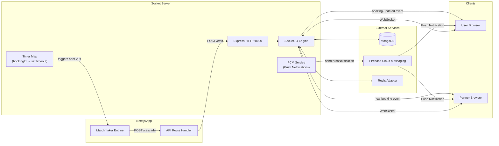
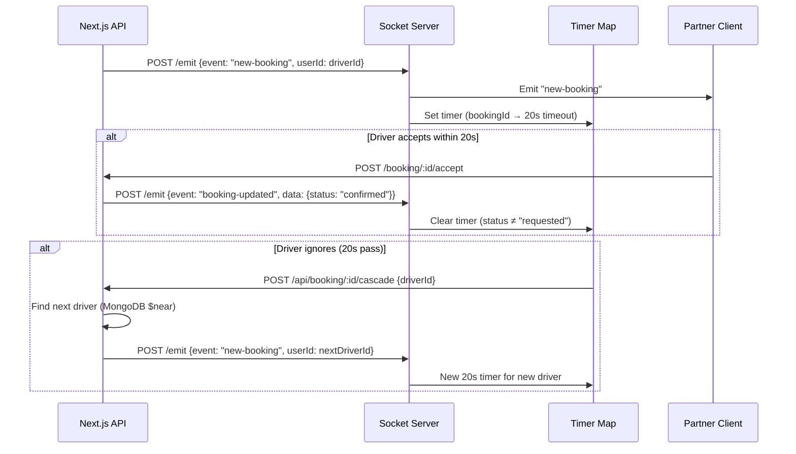

<div align="center">

# `socketServer` — Rydex Real-time Engine

### Node.js · Express · Socket.IO · Firebase · Redis · MongoDB

[](https://nodejs.org/)
[](https://socket.io/)
[](https://expressjs.com/)
[](https://firebase.google.com/)
[](https://redis.io/)
[](https://mongoosejs.com/)

*The nervous system of Rydex. Handles all real-time events — GPS coordinates, booking dispatches, in-ride chat, push notifications via FCM, and the matchmaker cascade timer.*

</div> 

---

## Why a Separate Server?

Next.js API routes are **stateless and serverless** — they can't hold long-lived WebSocket connections or maintain in-memory state like timers between requests. This dedicated Node.js server solves that by:

1. Maintaining **persistent WebSocket connections** with every connected client
2. Storing **active matchmaker timers** in a `Map` (memory-safe, per-booking)
3. **Broadcasting** targeted events to specific users by looking up their `socketId` in MongoDB
4. Acting as a **bridge** — the Next.js app POSTs to `/emit`, and this server dispatches to the right WebSocket
5. Sending **push notifications via Firebase Cloud Messaging (FCM)** when users are offline
6. Managing **Redis pub/sub** for horizontal scaling across multiple server instances

---

## Architecture Role



---

## Project Structure

```
socketServer/
├── index.ts                          # Entry point (Express + Socket.IO setup)
│   ├── Express app setup
│   ├── MongoDB connection
│   ├── CORS & middleware config
│   ├── Socket.IO server with Redis adapter
│   ├── /health endpoint
│   ├── /emit endpoint (with cascade + FCM logic)
│   ├── /emit-admin endpoint (admin broadcasts)
│   └── WebSocket event handlers
│
├── src/
│   ├── services/
│   │   ├── db.ts                     # MongoDB connection
│   │   ├── redis.ts                  # Redis pub/sub for scaling
│   │   ├── fcm.ts                    # Firebase Cloud Messaging service
│   │   ├── notifications.ts          # Real-time notification routing
│   │   ├── logger.ts                 # Event logging service
│   │   ├── timers.ts                 # Active timers management
│   │   └── cron.ts                   # Scheduled booking dispatch
│   │
│   ├── handlers/
│   │   ├── socket.ts                 # Socket.IO event handlers
│   │   └── redisSub.ts               # Redis subscription handler
│   │
│   └── middleware/
│       ├── auth.ts                   # Token authentication
│       └── cors.ts                   # CORS validation
│
├── models/
│   └── user.models.ts                # User model (socketId, fcmTokens, location)
│
├── tests/                            # Vitest integration tests
│
├── .env                              # Environment variables
├── package.json
└── README.md                         # ← You are here
```

---

## Services Architecture

The socket server is modularized into specialized services for horizontal scaling and maintainability:

### Core Services

| Service | File | Responsibility |
|---|---|---|
| **Database** | `src/services/db.ts` | MongoDB connection & pooling |
| **Redis** | `src/services/redis.ts` | Pub/Sub for multi-instance scaling + caching |
| **Firebase** | `src/services/fcm.ts` | Push notifications via Cloud Messaging |
| **Notifications** | `src/services/notifications.ts` | Real-time event routing to clients |
| **Logger** | `src/services/logger.ts` | Event logging for debugging |
| **Timers** | `src/services/timers.ts` | Matchmaker cascade timers (in-memory + Redis) |
| **Cron** | `src/services/cron.ts` | Scheduled booking dispatch jobs |

### Handlers & Middleware

| Handler | File | Responsibility |
|---|---|---|
| **Socket Events** | `src/handlers/socket.ts` | Incoming socket event handlers (identity, chat, location) |
| **Redis Sub** | `src/handlers/redisSub.ts` | Redis subscription handler for multi-instance pub/sub |
| **Auth** | `src/middleware/auth.ts` | Socket secret validation for internal endpoints |

### Why Modularization?

1. **Horizontal Scaling:** Redis adapter allows multiple socket server instances
2. **Testability:** Each service can be tested independently
3. **Maintainability:** Clear separation of concerns
4. **Resilience:** Redis provides fallback when in-memory state is lost
5. **Performance:** Specialized services optimized for their domain

---

## Socket Events

### Client → Server (incoming)

| Event | Payload | Description |
|---|---|---|
| `identity` | `userId: string` | Register this socket connection with a user ID. Updates `socketId` and `isOnline` in MongoDB. Enables multi-device support via Socket.IO identity rooms. |
| `join-booking` | `bookingId: string` | Join the private room `booking-{bookingId}`. Both driver and user call this to enter the same room. |
| `driver-location-update` | `{ bookingId, latitude, longitude }` | Driver broadcasts their GPS coordinates. Server fans out to all members of the booking room. |
| `chat-message` | `{ rideId, message, sender, ... }` | Send a message within the booking room. Server relays to all room members. |
| `update-location` | `{ latitude, longitude }` | Driver continuously updates their GeoJSON location in MongoDB (for nearby-driver search). |
| `disconnect` | — | Automatic. Server marks user `isOnline = false` and clears `socketId`. |

### Server → Client (outgoing)

| Event | Sent To | Payload | Description |
|---|---|---|---|
| `driver-location` | Booking room | `{ latitude, longitude, status }` | Live driver position for the map marker. |
| `chat-message` | Booking room | Full message object | In-ride chat message relay. |
| `new-booking` | Specific partner | Full booking object | New ride request dispatched to a driver. |
| `booking-updated` | Specific user/partner | `{ bookingId, status, ... }` | Booking state change notification. |

---

## HTTP Endpoints

### `GET /health`
Health check. Returns `{ success: true }`.

```bash
curl http://localhost:8000/health
# {"success":true}
```

---

### `POST /emit`
**The bridge endpoint.** Called by the Next.js API to push a WebSocket event to a specific user or broadcast to a booking room.

**Request body:**
```json
{
  "userId": "64abc123...",
  "event": "new-booking",
  "data": { "...booking object..." }
}
```

**Logic:**
1. Looks up the user by `_id` in MongoDB
2. If user has active WebSocket connection(s), emits the event to all their sockets (multi-device support)
3. If user is offline and has FCM tokens, sends a push notification via Firebase Cloud Messaging
4. Broadcasts to booking room if `bookingId` is in the data

**FCM Push Notification Behavior:**
The server automatically sends push notifications for these events if the user is offline:
- `new-booking` → "New Ride Request!" 
- `booking-updated` → "Ride Status Updated"
- `new-notification` → Custom title & body

**Invalid Token Cleanup:**
- When sending FCM notifications, the system collects invalid/expired tokens
- Invalid tokens are automatically removed from `User.fcmTokens` array
- This prevents repeated failures on subsequent push attempts

**Extra behavior for `new-booking` events:**
- Starts a **40-second countdown timer** for that booking (Redis + in-memory fallback)
- If the timer fires (driver didn't accept), POSTs to `{NEXT_BASE_URL}/api/booking/{id}/cascade`
- The cascade triggers the matchmaker to try the next nearest driver

**Extra behavior for `booking-updated` events:**
- If `status !== "requested"`, **clears the timer** (booking was accepted/cancelled, no cascade needed)

---

## The Cascade Timer System



**Key implementation detail:** Timers are stored in a `Map<bookingId, TimeoutHandle>`. This means:
- Multiple bookings can have simultaneous countdown timers
- Each booking has exactly one active timer at any time
- Old timers are always cleared before setting new ones (no duplicates)

---

## CORS Configuration

Only trusted origins are allowed to establish WebSocket connections:

```js
const allowedOrigins = [
  process.env.NEXT_BASE_URL,    // e.g. http://localhost:3000
  process.env.CLIENT_URL,       // custom override
  "https://rydexx.netlify.app", // production
  "http://localhost:3000",      // local dev
]
```

Trailing slashes are normalized (`normalizeOrigin`) to prevent false rejections from misconfigured clients.

---

## Firebase Cloud Messaging (FCM) Service

The `src/services/fcm.ts` module handles server-side push notifications:

### How It Works

1. **Client Registration:** Users allow browser notifications via `useFCM()` hook
2. **Token Collection:** FCM tokens are sent to backend via `POST /api/user/fcm-token`
3. **Fallback Delivery:** When WebSocket delivery fails (user offline), FCM takes over
4. **Multi-Device:** Each device can have its own FCM token, stored in `User.fcmTokens`
5. **Cleanup:** Invalid tokens are auto-removed from database

### Implementation

```typescript
// Send push to one or more users
async sendPushNotification(
  tokens: string[],          // Array of FCM tokens
  title: string,
  body: string,
  data?: Record<string, string>  // Optional custom data
)
```

### Firebase Admin Setup

The socket server uses **Firebase Admin SDK** for server-side push delivery. You must:

1. Create a Firebase project and download the service account JSON
2. Place it at `./firebase-admin.json` or set `FIREBASE_ADMIN_JSON_PATH` environment variable
3. Configure the following paths (in priority order):
   - `process.env.FIREBASE_ADMIN_JSON_PATH` (explicit path)
   - `/etc/secrets/firebase-admin.json` (production secret mount)
   - `./firebase-admin.json` (project root)
   - `../../firebase-admin.json` (relative fallback)

If Firebase Admin is not initialized, push notifications are **silently skipped** and WebSocket delivery is used as fallback.

### Notification Lifecycle

```
User goes offline
    ↓
WebSocket delivery fails
    ↓
Server fetches User.fcmTokens from MongoDB
    ↓
Firebase Admin SDK sends push to each token
    ↓
Invalid tokens collected → User.fcmTokens updated
    ↓
Browser receives notification → User sees alert
```

---

## MongoDB Usage

This server has a **minimal MongoDB footprint** — it only touches the `User` collection for:

| Operation | When | Fields |
|---|---|---|
| **Read** `socketId` | On `/emit` to find where to send | `socketId` |
| **Read** `fcmTokens` | When sending push notifications offline | `fcmTokens` (array) |
| **Write** `socketId`, `isOnline = true` | On `identity` event | `socketId`, `isOnline` |
| **Write** `fcmTokens` | On invalid token cleanup | `fcmTokens` ($pull operator) |
| **Write** `isOnline = false`, `socketId = null` | On `disconnect` | `isOnline`, `socketId` |
| **Write** `location` (GeoJSON) | On `update-location` event | `location.coordinates` |

The `location` field uses MongoDB's **2dsphere index**, enabling `$near` geo queries from the Next.js matchmaker.

The `fcmTokens` field is an array of Firebase Cloud Messaging tokens, one per user device for multi-device support.

---

## OpenTelemetry & Distributed Tracing

The socket server is configured with full **OpenTelemetry** support for distributed transaction tracing:

- **SDK Initialization**: The tracing engine is defined at `src/tracing.ts` and **MUST** be imported first at the top of `index.ts` so auto-instrumentations can intercept dependencies (Express, HTTP, MongoDB) as they load.
- **Trace Context Propagation**: Custom Express middleware extracts incoming W3C `traceparent` and `tracestate` headers sent by the frontend Next.js API client. This guarantees that HTTP calls from `rydexx` to the socket server's `/emit` endpoint continue the same trace rather than generating a new root span.
- **Auto-Instrumentation**: Captures HTTP incoming/outgoing traffic, Express routes and middleware overhead, and MongoDB queries (using standard command serialization).
- **Production Guard**: Tracing is safely disabled in production if `OTEL_EXPORTER_OTLP_ENDPOINT` is missing.

---

## Environment Variables

```env
# .env

# Server
PORT=8000
NODE_ENV=production

# Database
MONGODB_URL=mongodb+srv://<user>:<pass>@cluster.mongodb.net/rydex

# Socket Server Configuration
NEXT_BASE_URL=http://localhost:3000
CLIENT_URL=http://localhost:3000
SOCKET_INTERNAL_SECRET=<secret-for-internal-endpoints>

# Firebase Cloud Messaging (Optional - push notifications disabled if not set)
FIREBASE_ADMIN_JSON_PATH=./firebase-admin.json

# Redis (For horizontal scaling)
REDIS_URL=redis://localhost:6379

# OpenTelemetry Tracing (Optional in Dev / Safe fallback in Prod if blank)
OTEL_EXPORTER_OTLP_ENDPOINT=http://localhost:4317
```

**Firebase Admin JSON File:**
- Download from Firebase Console → Project Settings → Service Accounts
- Save to project root as `firebase-admin.json`
- Or set `FIREBASE_ADMIN_JSON_PATH=/path/to/firebase-admin.json`

---

## Running Locally

### 1. Prerequisites (Docker Services)
Ensure you have local instances of Redis (required for Socket Server Pub/Sub and caching) and Jaeger (required for viewing traces) running in Docker:
```bash
# Spin up Redis
docker run -d --name rydex-redis -p 6379:6379 --restart unless-stopped redis:alpine

# Spin up Jaeger
docker run -d --name jaeger -p 16686:16686 -p 4317:4317 --restart unless-stopped jaegertracing/all-in-one:latest
```

### 2. Run the App
```bash
# Install dependencies
npm install

# Start in development mode (nodemon + tsx compilation)
npm run dev

# Build and start in production mode
npm run build
npm start
```

**Expected output:**
```
◇ injected env (3) from .env
server started at 8000
```

---

## Deployment Notes

> **Important:** This server **must** be deployed to a platform that supports persistent long-lived processes with WebSocket support.

| Platform | WebSocket Support | Notes |
|---|---|---|
| **Railway** | ✅ | Recommended. Free tier available. |
| **Render** | ✅ | Free tier spins down after 15min inactivity |
| **Fly.io** | ✅ | Excellent for always-on WebSocket apps |
| **VPS (DigitalOcean, etc.)** | ✅ | Full control |
| Vercel Functions | ❌ | Serverless — no persistent connections |
| Netlify Functions | ❌ | Serverless — no persistent connections |

**Set these environment variables on your hosting platform:**
```
PORT=8000
MONGODB_URL=<your-atlas-uri>
NEXT_BASE_URL=https://your-nextjs-app.netlify.app
```

---

## Dependencies

```json
{
  "express": "^4.x",
  "socket.io": "^4.x",
  "mongoose": "^9.x",
  "axios": "^1.x",
  "dotenv": "*",
  "nodemon": "^3.x"
}
```

> No TypeScript here — kept intentionally simple as a lean Node.js service. The only responsibility is connection management, event routing, and timer orchestration.

---

## Testing

The WebSocket server features integration tests built with **Vitest**. The test suite tests the actual real-time connection lifecycle, event dispatches, and database updates without requiring running external databases or Redis clusters.

### Test Configuration
* **Test Runner:** Vitest ([vitest.config.js](file:///Users/fs/Documents/rydex/socketServer/vitest.config.js)) configured for a native Node.js environment.
* **Database Testing:** Connects to a local in-memory database server spun up by `mongodb-memory-server` in the test setup.
* **Redis Mocking:** Automatically mocks Redis connections with `ioredis-mock` to avoid requiring a running Redis instance in the testing environment.
* **Axios Mocking:** Mocks Axios calls so that Next.js cascade callbacks (`/api/booking/{id}/cascade`) are intercepted and mocked.
* **Dynamic Port Binding:** In the test environment (`process.env.NODE_ENV === "test"`), the server bypasses the production port (`8000`) and binds to a random free port dynamically (`server.listen(0)`), allowing you to run tests even if your local development server is running.

### Executing Tests
```bash
# Run socket server test suite once
npm run test

# Run tests in interactive watch mode
npm run test:watch
```

### Adding New WebSocket Tests
To add new tests, edit or add files in the `tests/` directory (e.g., `tests/socket.test.js`). 

To avoid ESM import hoisting conflicts with environmental variables:
1. Set up your `MongoMemoryServer` and `process.env` properties inside `beforeAll`.
2. Dynamically import the server variables (`server`, `io`) and mongoose models inside the `beforeAll` block:
```javascript
let server, io, User;

beforeAll(async () => {
  const mongoServer = await MongoMemoryServer.create();
  process.env.MONGODB_URL = mongoServer.getUri();
  process.env.NODE_ENV = "test";

  // Dynamically import server to guarantee env variables are read correctly
  const index = await import("../index.js");
  server = index.server;
  io = index.io;
  
  const user = await import("../models/user.models.js");
  User = user.default;
});
```
